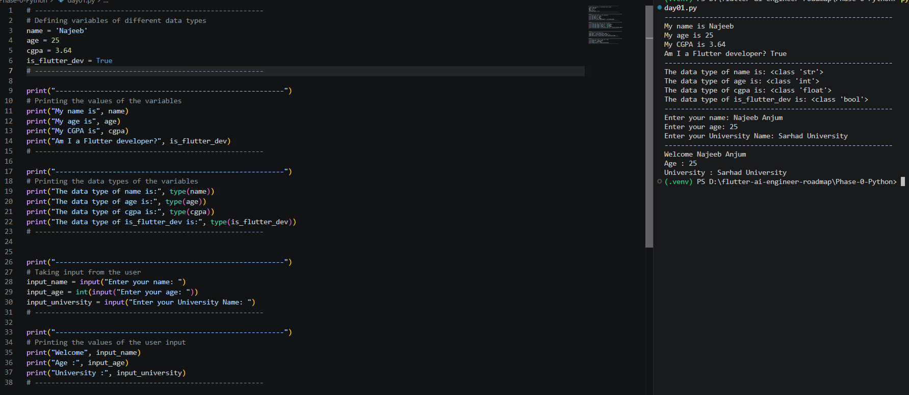
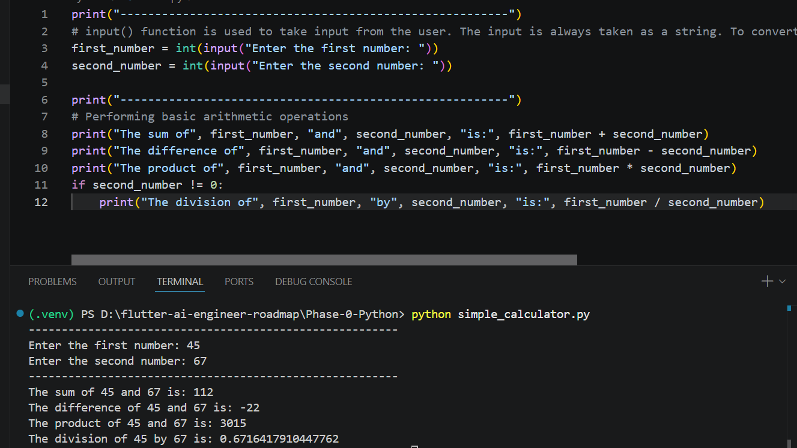

# 📂 Phase 0 — Python for AI

## Goal

Build a strong Python foundation required for AI Engineering.

## Topics

- ✅ Python Basics
- ✅ Variables
- ✅ Data Types
- ✅ Input / Output
- ✅ Operators
- ✅ Control Flow
- ✅ Functions
- ✅ Lists & Dictionaries
- ✅ File Handling
- ✅ JSON
- ✅ Error Handling
- ✅ Async Basics

## Mini Projects

- Calculator
- Student Card
- Expense Tracker
- Contact Book

# Phase 0 - Day 1

## Practice Output

---

## Task Output

## Demo

## Status

🚀 In Progress
